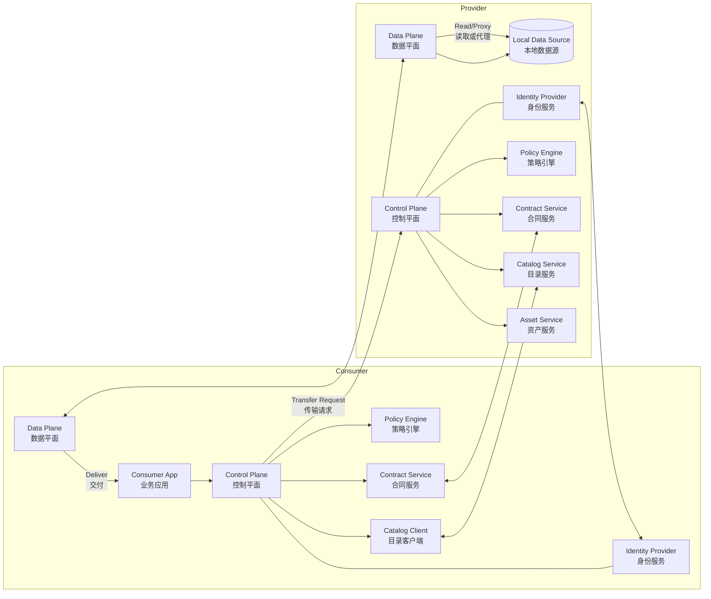
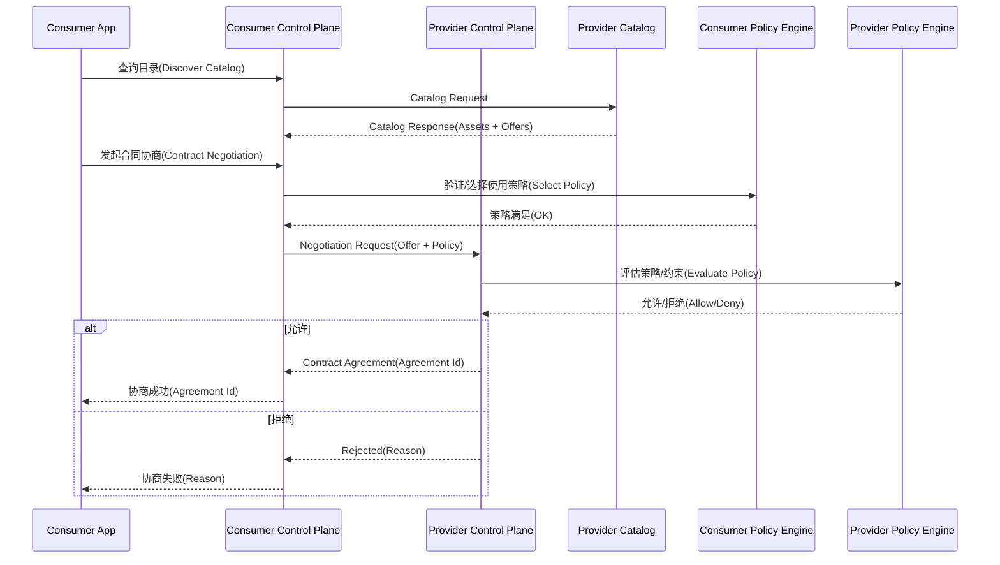
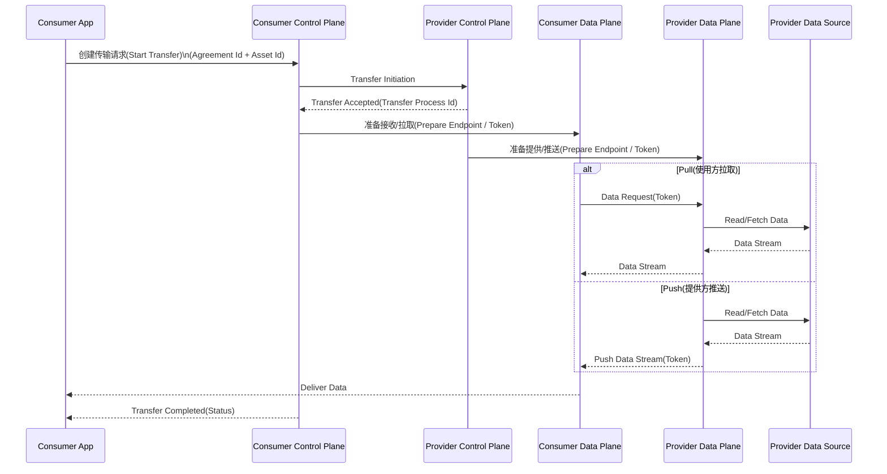

# 数据空间 EDC 连接器（Eclipse Dataspace Connector）详解

## 1. 背景与定位

EDC（Eclipse Dataspace Connector）是 Eclipse
基金会发起的一个开源项目，旨在为"数据空间（Dataspace）"提供可信、可控的数据交换基础设施。

在欧盟 Gaia-X、International Data Spaces (IDS)
等倡议推动下，数据空间强调：

-   数据不集中存储
-   数据所有权不转移
-   数据使用受策略控制
-   数据交换可审计、可追溯

EDC 的核心目标是： \> 在去中心化架构下，实现基于策略控制的数据共享。

------------------------------------------------------------------------

## 2. 什么是数据空间（Dataspace）

数据空间不是一个数据湖，也不是一个集中式平台，而是：

-   多参与方
-   去中心化部署
-   基于信任框架
-   通过标准协议交互

每个参与方运行自己的"连接器（Connector）"，数据始终保留在本地系统中，仅在授权条件下被访问或传输。

------------------------------------------------------------------------

## 3. EDC 连接器的核心能力

### 3.1 去中心化数据交换

-   每个组织运行自己的 EDC 实例
-   数据不需要上传到第三方平台
-   通过 API 或协议进行点对点协商和传输

### 3.2 策略驱动的数据控制（Policy-driven Data Sharing）

EDC 支持：

-   使用 ODRL（Open Digital Rights Language）描述数据使用规则
-   定义访问条件（如用途、时间范围、地域限制）
-   强制执行使用策略

例如：

-   仅允许用于"预测维护"用途
-   仅在合同期内访问
-   禁止转售

### 3.3 合同协商机制（Contract Negotiation）

数据交换流程包括：

1.  数据提供方发布资产（Asset）
2.  数据使用方发起协商请求
3.  双方达成 Contract Agreement
4.  执行数据传输

该流程完全自动化，可通过 API 实现机器对机器协商。

### 3.4 数据传输机制

EDC 支持：

-   Pull 模式
-   Push 模式
-   HTTP / S3 等协议扩展
-   可扩展数据平面（Data Plane）

数据平面负责实际的数据传输，控制平面负责协商与策略管理。

------------------------------------------------------------------------

## 4. 架构设计

EDC 采用模块化架构，主要分为：

### 4.1 控制平面（Control Plane）

负责：

-   资产管理
-   策略管理
-   合同协商
-   身份认证
-   目录发布

### 4.2 数据平面（Data Plane）

负责：

-   实际数据传输
-   数据代理
-   协议适配

控制平面与数据平面可分离部署，提高安全性与扩展性。

------------------------------------------------------------------------

---

## 4.3 架构图（Mermaid）

下面给出一个简化的 EDC 架构与交互视图，包含 **控制平面（Control Plane）**、**数据平面（Data Plane）**、以及提供方/使用方两侧连接器的典型协作关系。

### EDC 总体架构（控制平面 + 数据平面）

这张图表达的是 **角色分离 + 平面分离 + 信任连接**。

1️⃣ 两个参与方

- Provider（数据提供方）
- Consumer（数据使用方）

每一方都运行一套 **EDC Connector**。

这是去中心化的关键：
 没有中央服务器，每个参与者都部署自己的连接器。

2️⃣ 控制平面 vs 数据平面

这是 EDC 最重要的设计之一。

控制平面（Control Plane），负责“决定是否可以共享”。

包括：

- Asset Service（管理可共享资产）
- Catalog Service（对外发布数据目录）
- Contract Service（合同协商）
- Policy Engine（策略评估）
- Identity Provider（身份与信任）

它处理的是：

- 目录查询
- 合同协商
- 策略验证
- 生成 Agreement
- 启动传输流程

⚠ 它不传输实际数据。

------

数据平面（Data Plane），负责“真正的数据流动”。

它：

- 从本地数据源读取数据
- 执行 token 校验
- 执行策略限制
- 传输数据流

这部分可以独立扩展（例如 S3、HTTP、Kafka 插件）。

------

### 合同协商时序图

流程拆解

1️⃣ 查询目录

Consumer → Provider Catalog

拿到：

- Asset
- Offer
- Policy

这是“你有哪些数据，条件是什么”。

------

2️⃣ 发起合同协商

Consumer 选择一个 Offer：

- 附带使用策略
- 附带用途说明

发送给 Provider。

------

3️⃣ Provider 策略评估

Provider 的 Policy Engine 会判断：

- 用途是否匹配
- 时间是否有效
- 是否满足附加条件

如果不满足 → 拒绝。

如果满足 → 生成 Agreement。

------

4️⃣ 输出结果

成功时返回：

- Agreement ID

这个 ID 是后续所有数据传输的前提。

没有 Agreement，就没有传输。

------

### 数据传输时序图

1️⃣ 启动传输

Consumer 提供：

- Agreement ID
- Asset ID

请求启动 Transfer Process。

控制平面记录：

- Transfer Process ID
- 状态

------

2️⃣ 数据平面准备

双方准备：

- 访问 token
- Endpoint
- 安全通道

------

3️⃣ 两种传输模式

Pull 模式（更常见）

Consumer Data Plane → Provider Data Plane

流程：

1. Consumer 发请求
2. Provider 验证 token
3. 读取本地数据源
4. 返回数据流

------

Push 模式

Provider 主动推送数据给 Consumer。

适用于：

- 事件驱动
- 数据批量分发

------

4️⃣ 数据交付

Consumer Data Plane → Consumer App

此时数据才真正进入业务系统。

## 5. 核心概念

  概念                   说明
---------------------- ------------------
  Asset                  可共享的数据资源
  Policy                 数据使用规则
  Contract Definition    资产与策略的组合
  Contract Negotiation   合同协商流程
  Transfer Process       数据传输过程
  Catalog                数据目录

------------------------------------------------------------------------

## 6. 典型工作流程

1.  提供方创建 Asset
2.  绑定 Policy 形成 Contract Definition
3.  发布到 Catalog
4.  使用方查询 Catalog
5.  发起 Contract Negotiation
6.  签署 Agreement
7.  发起 Transfer Process
8.  数据传输完成

------------------------------------------------------------------------

## 7. 与 IDS / Gaia-X 的关系

-   EDC 可实现 IDS 参考架构
-   支持 Gaia-X 合规场景
-   兼容 Self-Sovereign Identity（SSI）机制
-   支持去中心化信任框架

------------------------------------------------------------------------

## 8. 技术栈与实现特点

-   Java 实现
-   基于 SPI 可扩展架构
-   支持扩展模块（存储、协议、认证等）
-   云原生部署（Docker / Kubernetes）
-   支持多种后端数据库

------------------------------------------------------------------------

## 9. 安全机制

-   双向 TLS
-   基于身份的访问控制
-   JWT / OAuth2 支持
-   策略强制执行
-   可审计日志

------------------------------------------------------------------------

## 10. 优势

-   真正去中心化
-   细粒度策略控制
-   高扩展性
-   标准化接口
-   适用于跨组织数据协作

------------------------------------------------------------------------

## 11. 局限性与挑战

-   部署复杂度较高
-   策略建模成本高
-   性能依赖网络与数据平面实现
-   生态尚在成熟阶段

------------------------------------------------------------------------

## 12. 适用场景

-   工业数据共享
-   供应链协同
-   车联网数据空间
-   医疗数据互通
-   跨企业 AI 训练数据共享

------------------------------------------------------------------------

## 13. 总结

EDC 连接器是当前数据空间领域最重要的开源实现之一。

它的核心价值不在于"数据传输"，而在于：

> 在去中心化环境中，提供可执行的数据使用控制。

如果目标是构建跨组织可信数据共享体系，而非单纯 API 集成，EDC
是基础设施级组件。
